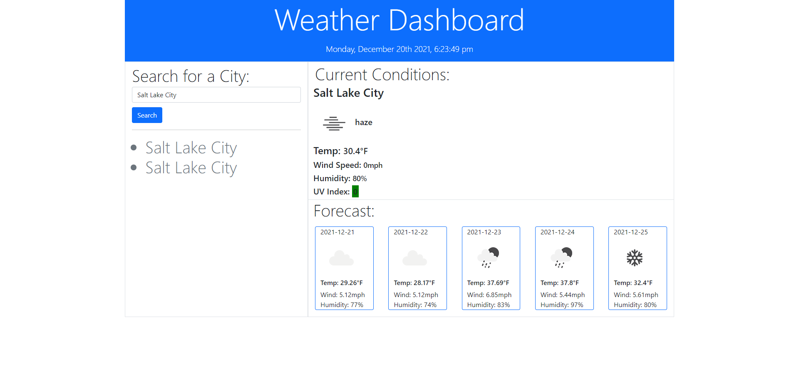

# Weather Dashboard - Week #6
## Created by Scott Nichols

The Weather Dashboard website allows a user to type in any city and recieve the current weather conditions and the 5-day future forecast using 3 OpenWether APIs.  It also displays the current date and time through the momentJS API.

The Current Condition section includes a summary of the following:
* Current Weather Conditions
* Temperature
* Wind Speed
* Humidity
* Current UV Index  

The 5-day Forecast section include the following:
* Predicted Weather Summary,
* Temperature
* Wind Speed
* Humidity

The dashboard has a section to input the city of interest with the ability to either click on the "Search" button or press the "enter" key to initiate search and display conditions. Upon reload, the site will automatically load the latest city searched.

There is also a section to display past searches, that is persistently stored with local storage.

### Instructions -
The site is very userfriendly, only having to type in any city in the input bar and press enter or click "search".

Git Hub Repo: https://github.com/Sessions21/Weather-Dashboard
Website URL: https://sessions21.github.io/Weather-Dashboard/

